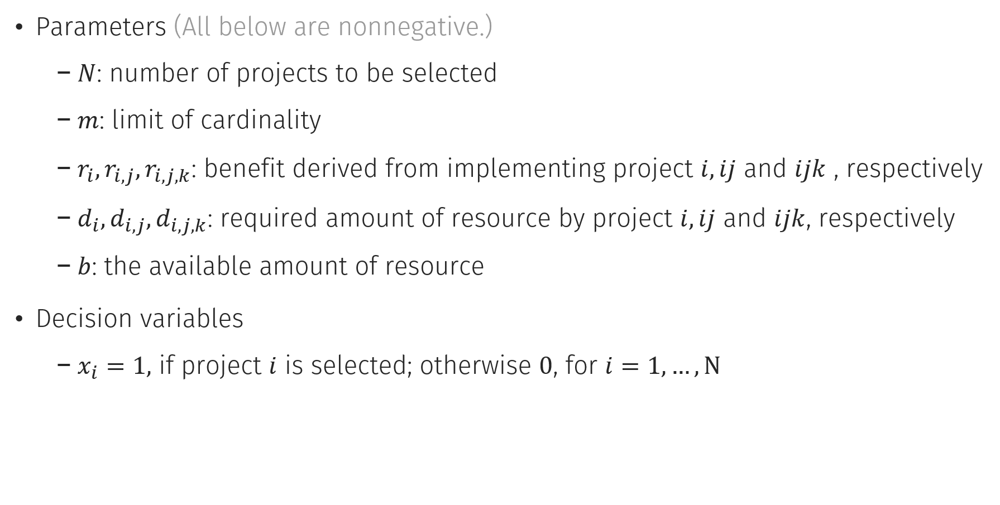

# Project Portfolio Selection Problem (PPSP)
 Efficient formulations for PPSP problem considering cardinality and interdependency

## Introduction
In the project portfolio selection problem (PPSP), a decision maker must select a set of projects to launch and try to maximize the profit. Meanwhile, there are some factors considered by a DM. In this study, we consider (1.) project interdependency and (2.) cardinality constraint only.

1. Project Interdependency: PPSP may be affected by synergy effect from the various combinations of different projects. For instance, if we launch 2 projects simultaneously, then it may earn you additional benefits a.k.a. synergestic benefit. Moreover, resource interdependency occurs when common resources are shared by various projects. Thus, to find a novel combinations of projects may increase the potential benefit.
2. Cardinality Constraint: Cardinality is the number of projects selected in the portfolio. Thus, this number is restricted below a given numbr in this constraint.

In the rest of this tutorial, there are model formulation, Python + Gurobi implementation, an example and advanced topics.

## Model Formulaton
In the original paper, both equality and inequality cardinality constraint cases are considered, but I will demostrate the equality constraint cases only in this tutorial. You can find inequality constraint cases referred to the paper [[2]](#2).

We first introduce some notations.



For instance,
if project <!-- $i, j$ -->  and <!-- $k$ -->  are selected, which means <!-- $x_i=x_j=x_k=1$ --> . Then, the total benefit will be <!-- $(r_i+r_j+r_k)+(r_{i,j}+r_{i,k}+r_{j,k})+(r_{i,j,k})$ --> , and this combination will consume <!-- $(d_i+d_j+d_k)-(d_{i,j}+d_{i,k}+d_{j,k})+(d_{i,j,k})$ -->  resoure in the mean time. One can notice that there is a minus sign in the equation about resource, since shared-used concept is considered here. This concept follows standard Venn diagram (文氏圖).

### Nonlinear Model

Nonlinear model is quite simple in this problem. Our objective is to maximize the total benefit subject to cardinality and resource constraints.

<!-- $
\begin{aligned}
Max ~ & \underbrace{\sum\limits_{i = 1}^N r_i x_i + 
\sum\limits_{i = 1}^{N-1} \sum\limits_{j = 1+1}^N  r_{i,j}x_i x_j + 
\sum\limits_{i = 1}^{N-2} \sum\limits_{j = i+1}^{N-1} \sum\limits_{k = j+1}^N r_{i,j,k} x_i x_j x_k}_{\text{total benefit}} 
\\
s.t. ~ & \underbrace{\sum\limits_{i = 1}^N x_i = m}_{\text{cardinality constraint}} \\
        & \underbrace{\sum\limits_{i = 1}^N d_i x_i -
\sum\limits_{i = 1}^{N-1} \sum\limits_{j = 1+1}^N  d_{i,j}x_i x_j + 
\sum\limits_{i = 1}^{N-2} \sum\limits_{j = i+1}^{N-1} \sum\limits_{k = j+1}^N d_{i,j,k} x_i x_j x_k \leq b}_{\text{resource constraint}} \\
& x_i \in \{0, 1\},\; i = 1, \ldots ,N 
\end{aligned}
$ --> 

Although this model is quite simple to understand, it's inefficient due to the polynomial integer programming property. Thus, its implementaion is omitted. 

### Conventional Model (Equality Cardinality Constraint)
In thish model, we introduce 2 set of decicsion variables <!-- $\mathbf{y} = (y_{1,2}, \ldots, y_{1,N}, y_{2,3}, \ldots, y_{N-1, N}) \in \mathbb{R}^{\frac{N(N-1)}{2} = {N \choose 2}}$ -->  and <!-- $\mathbf{z} = (z_{1,2,3}, \ldots, z_{1,N-1,N}, z_{2,3,4}, \ldots, z_{N-2,N-1,N}) \in \mathbb{R}^{\frac{N(N-1)(N-2)}{6}= {N \choose 3}}$ --> . One can notice that the subscripts of each decision variables are in an ascending order s.t. every combination will have an unique representation. 

<!-- $
\begin{aligned}
Max ~ & \sum\limits_{i = 1}^N r_i x_i + 
\sum\limits_{i = 1}^{N} \sum\limits_{j > i}^N  r_{i,j}y_{i,j} + 
\sum\limits_{i = 1}^{N} \sum\limits_{j > i}^{N} \sum\limits_{k > j}^N r_{i,j,k} z_{i,j,k} \\
\\
s.t. ~ & \sum\limits_{i = 1}^N x_i = m \\
       & \sum\limits_{i = 1}^N d_i x_i - \sum\limits_{i = 1}^{N} \sum\limits_{j > i}^N  d_{i,j}y_{i,j} + \sum\limits_{i = 1}^{N} \sum\limits_{j > i}^{N} \sum\limits_{k > j}^N d_{i,j,k} z_{i,j,k} \leq b \\
       & \underbrace{\sum\limits_{j>i}^N y_{i,j} + \sum\limits_{j<i}^N y_{j,i} + \sum\limits_{j>i}^N \sum\limits_{k>j}^N z_{i,j,k} + \sum\limits_{i>j}^N \sum\limits_{k>i}^N z_{j,i,k} +\sum\limits_{k>j}^N \sum\limits_{i>k}^N z_{j,k,i} = \frac{m(m-1)}{2} x_i,\; \text{for } i = 1,\ldots ,N}_{\textstyle \begin{array}{c} \Leftrightarrow x_ix_j = y_{i,j} \text{ and } x_i x_j x_k = z_{i,j,k} \end{array}} \\
       & x_i \in \{0, 1\} \text{ and } 0 \leq y_{i,j}, z_{i,j,k} \leq 1, \; \text{for } i,j,k = 1, \ldots ,N, \text{ and } i<j<k
\end{aligned}
$ --> 


### Proposed Model (Equality Cardinality Constraint)

In this model, <!-- $\mathbf{y}$ -->  decision variables are replaced with <!-- $\mathbf{z}$ -->  via some equations. Related proofs can be found in [[2]](#2).

<!-- $
\begin{aligned} 
Max ~ & \sum\limits_{i = 1}^N r_i x_i + 
\underbrace{\frac{1}{m-2}\sum\limits_{i = 1}^{N} \sum\limits_{j > i}^N \sum\limits_{k > j}^N (r_{i,j} + r_{i,k} + r_{j,k})z_{i,j,k}}_{\textstyle \begin{array}{c} =\sum\limits_{i = 1}^{N} \sum\limits_{j > i}^N  r_{i,j}y_{i,j} \end{array}} + 
\sum\limits_{i = 1}^{N} \sum\limits_{j > i}^{N} \sum\limits_{k > j}^N r_{i,j,k} z_{i,j,k}
\end{aligned} 
$ --> 

<!-- $
\begin{aligned} 
s.t. ~ & \sum\limits_{i = 1}^N x_i = m \\
       & \sum\limits_{i = 1}^N d_i x_i - \underbrace{\frac{1}{m-2} \sum\limits_{i = 1}^{N} \sum\limits_{j > i}^N \sum\limits_{k > j}^N (d_{i,j} + d_{i,k} + d_{j,k}) z_{i,j,k}}_{\textstyle \begin{array}{c} =\sum\limits_{i = 1}^{N} \sum\limits_{j > i}^N  d_{i,j}y_{i,j} \end{array}} + \sum\limits_{i = 1}^{N} \sum\limits_{j > i}^{N} \sum\limits_{k > j}^N d_{i,j,k} z_{i,j,k} \leq b \\
       & \underbrace{\sum\limits_{j>i}^N \sum\limits_{k>j}^N z_{i,j,k} + \sum\limits_{i>j}^N \sum\limits_{k>i}^N z_{j,i,k} +\sum\limits_{k>j}^N \sum\limits_{i>k}^N z_{j,k,i} = \frac{(m-1)(m-2)}{2} x_i, \; \text{for } i = 1,\ldots ,N}_{\textstyle \begin{array}{c} \Leftrightarrow  x_i x_j x_k = z_{i,j,k} \end{array}}\\
       & x_i \in \{0, 1\} \text{ and } 0 \leq z_{i,j,k} \leq 1, \; \text{for } i,j,k = 1, \ldots ,N, \text{ and } i<j<k
\end{aligned}
$ --> 

### Conventional and Proposed Model (Inequality Cardinality Constraint)

The basic idea is to introduce a set of binary variables in order to represent the cardinality, which is less than or equal to <!-- $m$ --> .

The details of the formulation can be also found in the original paper [[2]](#2).

## Python + Gurobi Implementation

First, make sure you have installed the following packages and have Gurobi license:
```
numpy
gurobipy
```
I implemented four kinds of models including conventional model and proposed model with equality/ inequality cardinality constraint.

### Problem Solver
```
def PPSP_solver(N, m, r_i, r_ij, r_ijk, d_i, d_ij, d_ijk, b, mode, equality=True)
```

* Parameters
  - `N`: *int*
  - `m`: *int*
  - `r_i`: *dict of 1-D index*, e.g., `r_i[1]` means the benefit from implementing project 1.
  - `r_ij`: *dict of 2-D index*, e.g., `r_ij[1, 2]` means the benefit from implementing project 1 and 2.
  - `r_ijk`: *dict of 3-D index*, e.g.,  `r_ijk[1, 2, 3]` means the benefit from implementing project 1, 2 and 3.
  - `d_i`: *dict of 1-D index*, e.g., `d_i[1]` means the resource required from implementing project 1.
  - `d_ij`: *dict of 2-D index*, e.g., `d_ij[1, 2]` means the resource required from implementing project 1 and 2.
  - `d_ijk`: *dict of 3-D index*, e.g., `d_ijk[1, 2, 3]` means the resource required from implementing project 1, 2 and 3.
  - `b`: *float*
  - `mode`: *{'conventional', 'proposed'}, default='proposed'*
  - `equality`: *bool, default='True'*
  - `time_limit`: *int, default=3600*, the time limit to optimize the model
  - `is_quiet`: *bool, default=True*, enables or disables solver output

* Returns
  - *gurobipy.Model*

The parameter `mode` can be either 'conventional' or 'proposed' with `equality` being 'True' or 'False'. So, there are 4 kinds of model. The output of this function is an optimized Gurobi model. You can access it directly.

### Instance Generator
Additionally, you can automatically generate the instances by given N and m.

The parameters are basically uniformly distributed, which follows [[1]](#1):

- Resource
  + <!-- $d_{i} \sim \text{Uniform}(1,10)$ --> 
  + <!-- $d_{i,j} \sim \text{Uniform}(5,20)$ --> 
  + <!-- $d_{i,j,k} \sim \text{Uniform}(10,50)$ --> 
  + <!-- $b \sim \text{Uniform}(0.05G, 0.1G),\, G = \sum_{i}d_i - \sum_{i}\sum_{i<j}d_{i,j}+\sum_{i}\sum_{i<j}\sum_{j<k}d_{i,j,k}$ --> 
- Benefit
  + <!-- $r_{i} \sim \text{Uniform}(10,100)$ --> 
  + <!-- $r_{i,j} \sim \text{Uniform}(50,200)$ --> 
  + <!-- $r_{i,j,k} \sim \text{Uniform}(100,500)$ --> 

```
def instance_generator(N, m)
```
* Parameters
  - `N`: *int*
  - `m`: *int*
* Returns
  - *dict*

## Example
Please access 'example.ipynb' to run the code.

```
import numpy as np
import gurobipy as gp
from gurobipy import GRB

from model import PPSP_solver, instance_generator

# generate a problem instance with N = 16 and m = 3
instance = instance_generator(16, 3)

# solve the instance with four kinds of models and print the result with running time
for is_equal in [True, False]:
    if is_equal:
        print('-----------  Equality Cardinality Constraint  -----------')
    else:
        print('-----------  InEquality Cardinality Constraint  -----------')
        
    for mode_ in ['conventional', 'proposed']:
        model = PPSP_solver(**instance, mode=mode_, equality=is_equal)
        
        if  model.status == GRB.OPTIMAL:
            portfolio = []
            for v in model.getVars():
                if 'x' in v.varName and abs(v.x-1) <= 0.0001:  # avoid rounding error
                    name = v.varName
                    portfolio.append(name[name.find('[') + 1:-1])

            print(f'Mode: {mode_}')
            print(f'\t Objective Value: {model.ObjVal}')
            print(f'\t Optimal Portfolio:', ','.join(portfolio))
            print(f'\t Running Time: {model.RunTime}')
    print()
```

## Advanced Topics
So far, we have already handled order two and order three terms, but I want to provide the treatment for higher order terms. Basically, the extension of properties and theorems from [[2]](#2) can reach the goal. Thus, there are two corollaries below. The first one is the extension from proposition 1 and 2, and the second one is extended from theorem 1 in [[2]](#2). 

---

**<u>Corollary 1.</u>**
Let <!-- $m$ -->  and <!-- $N$ -->  be given positive integers such that <!-- $1 \leq m < N$ -->  and assume that <!-- $x_i \in \{0, 1\}$ -->  for <!-- $i = 1,
\ldots ,N$ -->  satisfying <!-- $\sum\limits_{i=1}^N{x_{i}}=m$ --> . For a set of non-negative variables <!-- $x^{[p]}_{i_1, i_2, \ldots i_p} \in [0, 1],~~ i_1, i_2, \ldots i_p \in \{1, \ldots ,N\}$ -->  with all of the subscripts being distinct, if  

<!-- $$
\begin{aligned}
& \sum\limits_{i_1 < i_2}^N \sum\limits_{i_2<i_3}^N \cdots \sum\limits_{i_{p-1} < i_p}^N {x^{[p]}_{i_1, i_2, \ldots i_p}} + \\
& \sum\limits_{i_2 < i_1}^N \sum\limits_{i_1<i_3}^N \cdots \sum\limits_{i_{p-1} < i_p}^N {x^{[p]}_{i_2, i_1, \ldots i_p}} + \cdots +\\
& \sum\limits_{i_2 < i_3}^N \sum\limits_{i_3<i_4}^N \cdots \sum\limits_{i_p < i_1}^N {x^{[p]}_{i_2, i_3, \ldots i_1}} = {m-1 \choose p-1} x_{i_1},~ \text{for}~ i_1 = 1, \ldots ,N\text{,}
\end{aligned}
$$ --> 

<div align="center"></div>

then <!-- $x_{i_1}x_{i_2} \cdots x_{i_p} = x^{[p]}_{i_1, i_2, \ldots i_p}$ --> 

**<u>Proof.</u>**
If <!-- $N > p$ -->  and denote <!-- $\mathcal{A} = \{i | x_i=1 \} \subseteq \{1, 2, \ldots, N\}$ --> , then there are <!-- $m$ -->  elements in  <!-- $\mathcal{A}$ --> . We have <!-- $x^{[p]}_{i_1, i_2, \ldots i_p} = x_1 x_2 \ldots x_p = 0$ -->  if and only if <!-- $i_1, i_2, \cdots i_{p-1}$ -->  and <!-- $i_p$ -->  is not in <!-- $\mathcal{A}$ --> . For any <!-- $i_1' \in \mathcal{A}$ --> , the value of the right-hand side is <!-- ${m-1 \choose p-1}$ --> . Since there are <!-- ${m-1 \choose p-1}$ -->  possible nonzero terms like <!-- $x^{[p]}_{i_1', i_2', \ldots i_p'}$ --> , <!-- $x^{[p]}_{i_2', i_1', \ldots i_p'}$ -->  and <!-- $x^{[p]}_{i_2', i_3', \ldots i_1'}$ -->  for <!-- $i_2', \ldots i_p' \in \mathcal{A}$ -->  on the left-hand side, and all <!-- $x^{[p]}_{i_1, i_2, \ldots i_p}$ --> 's are no more than 1, it follows that <!-- $x^{[p]}_{i_1', i_2', \ldots i_p'} = x_{i_1'} x_{i_2'} \cdots x_{i_p'}$ -->  for <!-- $i_1', i_2', \ldots i_p' \in \mathcal{A}$ -->  and <!-- $i_1' < i_2' < \ldots < i_p'$ --> .

---


**<u>Corollary 2.</u>**
For a vector <!-- $\mathbf{x} = (x_1, \ldots , x_N) \in \{0, 1\}^N$ --> , one set of non-negative variables <!-- $x^{[p]}_{i_1, i_2, \ldots i_p} \in [0, 1],\; i_1, i_2, \ldots i_p \in \{1, \ldots ,N\}$ --> , and one set of non-negative variables <!-- $x^{[p+1]}_{i_1, i_2, \ldots i_{p+1}} \in [0, 1],\; i_1, i_2, \ldots i_p, i_{p+1} \in \{1, \ldots ,N\}$ -->  with all of the subscripts being distinct and <!-- $p+1 \leq m < N$ --> , where <!-- $m$ -->  and <!-- $N$ -->  are two integer variables. Let <!-- $r_{i_1, i_2, \ldots i_p}$ -->  be the additional benefit from implementing project <!-- $i_1, i_2, \cdots ,i_{p-1}, i_p$ -->  simultaneously. If the constraints from **<u>Corollary 1.</u>** with <!-- $p \rightarrow p$ -->  and <!-- $p \rightarrow p +1$ --> , and <!-- $\sum_{i=1}^N x_i = 1$ -->  are satisfied, then  

<!-- $$
\sum\limits_{i_1 = 1}^N \sum\limits_{i_2 > i_1}^N \cdots \sum\limits_{i_{p} > i_{p-1}}^N (r_{i_1, i_2, \ldots i_p}) {x^{[p]}_{i_1, i_2, \ldots i_p}} = \frac{1}{m-p}\sum\limits_{i_1 = 1}^N \sum\limits_{i_2 > i_1}^N \cdots \sum\limits_{i_p > ~ i_{p-1}}^N \sum\limits_{i_{p+1} > i_p}^N (r_{i_1, i_2 \ldots i_p} + r_{i_1, i_3, \ldots i_{p+1}} + r_{i_1, i_4, \ldots i_{p+1}} + \cdots + r_{i_2, i_3, \ldots i_{p+1}})  x^{[p+1]}_{i_1, i_2, \ldots i_{p+1}}
$$ --> 

<div align="center"></div>

**<u>Proof.</u>**
If <!-- $p+1 \leq m < N$ --> , there exist unique <!-- $i_1', i_2', \ldots i_m'$ -->  such that <!-- $x_{i_1'}, x_{i_2'}, \ldots x_{i_m'} = 1$ --> . Denote <!-- $\mathcal{A} = \{i_1', i_2', \ldots i_m'\}$ --> .
1. It is clear that when any <!-- $p$ -->  projects are selected (i.e., if <!-- $x_{i_1'}=x_{i_2'}= \cdots = x_{i_p'} = 1$ -->  then <!-- $x^{[p]}_{i_1', i_2', \ldots, i_p'} = 1$ --> ), the left-hand side becomes <!-- $\sum\limits_{i_1 = 1}^N \sum\limits_{i_2 > i_1}^N \cdots \sum\limits_{i_{p} > i_{p-1}}^N (r_{i_1, i_2, \ldots i_p}) {x^{[p]}_{i_1, i_2, \ldots i_p}} = r_{i_1', i_2' \ldots i_p'} + r_{i_1', i_3', \ldots i_{p+1}'} + r_{i_2', i_3', \ldots i_{p+1}'} + \cdots + r_{i_{m-(p-1)}', i_{m-(p-2)}', \ldots, i_{m-1}', i_{m}'}$ --> 
2. Similarily, when any <!-- $p+1$ -->  projects are selected (i.e., if <!-- $x_{i_1'}=x_{i_2'}= \cdots = x_{i_p'} = x_{i_{p+1}}' = 1$ -->  then <!-- $x^{[p+1]}_{i_1', i_2', \ldots, i_p', i_{p+1}'} = 1$ --> ), the right-hand side becomes <!-- $\frac{1}{m-p}\sum\limits_{i_1 = 1}^N \sum\limits_{i_2 > i_1}^N \cdots \sum\limits_{i_p > ~ i_{p-1}}^N \sum\limits_{i_{p+1} > i_p}^N (r_{i_1, i_2 \ldots i_p} + r_{i_1, i_3, \ldots i_{p+1}} + r_{i_1, i_4, \ldots i_{p+1}} + \cdots + r_{i_2, i_3, \ldots i_{p+1}})  x^{[p+1]}_{i_1, i_2, \ldots i_{p+1}} =r_{i_1', i_2' \ldots i_p'} + r_{i_1', i_3', \ldots i_{p+1}'} + r_{i_2', i_3', \ldots i_{p+1}'} + \cdots + r_{i_{m-(p-1)}', i_{m-(p-2)}', \ldots, i_{m-1}', i_{m}'}$ --> . Without loss of generality, we can take <!-- $r_{i_1', i_2' \ldots i_p'}$ -->  for example. In the RHS, <!-- $x^{[p+1]}_{i_1', i_2' \ldots i_p', j} = 1$ --> , where <!-- $j \in \mathcal{B} = \mathcal{A} \backslash \{i_1', i_2' \ldots i_p'\}$ -->  with <!-- $|\mathcal{B}| = m - p$ --> . It shows that <!-- $r_{i_1', i_2' \ldots i_p'}$ -->  will repeat <!-- $m - p$ -->  times compared to LHS, so there is a coefficient <!-- $\frac{1}{m-p}$ -->  in front of the summation.

Proved.
    
> With **<u>Corollary 2.</u>**, one can extend propsion 3, 4 and 5 in [[2]](#2) easily.


## References
<a id="1">[1]</a> Xingmei Li, Yao-Huei Huang, Shu-Cherng Fang and Zhibin Deng (2016), Reformulations for project portfolio selection problem considering interdependence and cardinality, *Pacific Journal of Optimization*, 12(2), 355-366.  
<a id="1">[2]</a> Xingmei Li, Yao-Huei Huang , Shu-Cherng Fang , Youzhong Zhang (2020), An alternative efficient representation for the project portfolio selection problem, *European Journal of Operational Research*, 281(1), 100-113.


